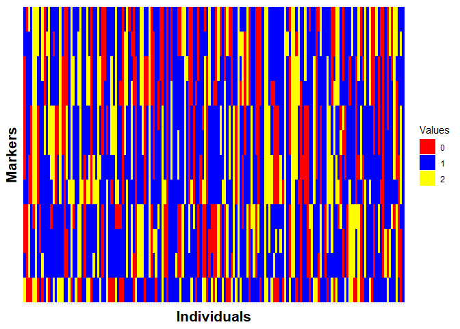
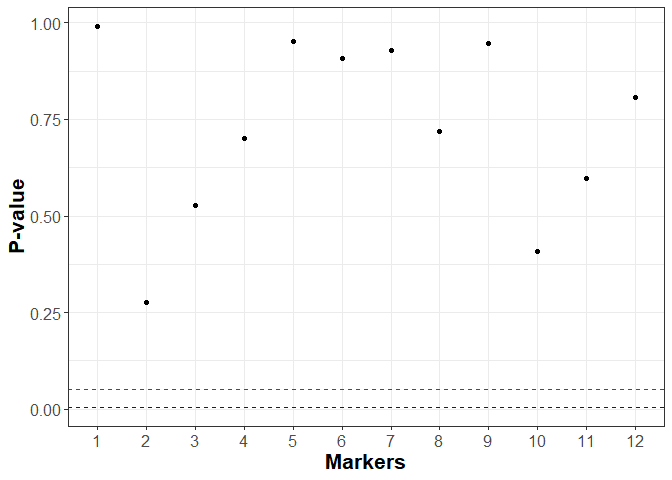
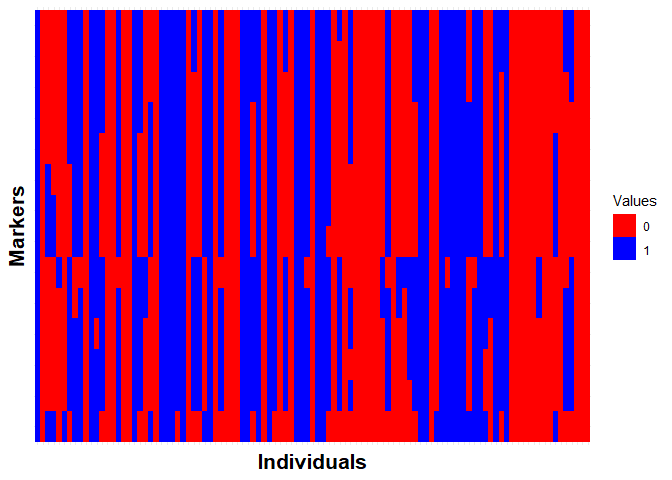
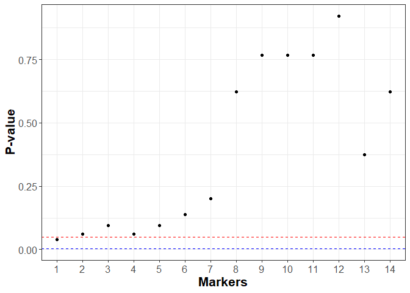

Chi-square Test
================
Hernandes Peres
2025-04-01

- [0.0.1 Cleaning and loading
  packages](#001-cleaning-and-loading-packages)
- [1 A F2 population](#1-a-f2-population)
  - [1.0.1 Loading dataset - maize](#101-loading-dataset---maize)
  - [1.0.2 Markers info](#102-markers-info)
  - [1.0.3 Chi-square tests ($\chi$²)](#103-chi-square-tests-chi²)
- [2 A Backcross population](#2-a-backcross-population)
  - [2.0.1 Loading dataset - mouse](#201-loading-dataset---mouse)
  - [2.0.2 Makers info](#202-makers-info)
  - [2.0.3 Chi-square Test ($\chi$²)](#203-chi-square-test-chi²)

### 0.0.1 Cleaning and loading packages

``` r
knitr::opts_chunk$set(echo = TRUE, message = FALSE, warning = FALSE, error = FALSE)
```

``` r
remove(list = ls())
library(tidyverse)
```

# 1 A F2 population

The $F_{2}$ population is derived from the selfing of the $F_{1}$
progeny (Aa). The $F_{2}$ population has three genotypes: $AA$, $Aa$,
and $aa$, which segregate in a 1:2:1 ratio $(0.25, 0.5, 0.25)$.

### 1.0.1 Loading dataset - maize

``` r
maize_df <- read.csv("maize.csv")

head(maize_df)
```

    ##   IND M1 M2 M3 M4 M5 M6 M7 M8 M9 M10 M11 M12   GY
    ## 1   1  2  1  0  0  0  0  0  1  1   1   0   0 6.25
    ## 2   2  1  1  1  1  1  2  2  2  2   0   0   1 3.00
    ## 3   3  1  2  2  2  2  1  1  1  1   2   2   2 3.00
    ## 4   4  1  0  0  0  0  0  0  0  0   1   2   2 4.00
    ## 5   5  0  0  1  1  1  1  1  1  1   1   1   1 3.00
    ## 6   6  1  0  0  0  0  1  1  1  1   0   0   0 3.75

``` r
dim(maize_df)
```

    ## [1] 171  14

``` r
markers <- maize_df[,2:13]
```

### 1.0.2 Markers info

So, using **ggplot** and **dplyr**, both packages from the
**tidyverse**, we can organize and plot a nicer chart to verify the
markers segregation distribution.

``` r
markers %>% mutate(ind = rownames(markers)) %>%
  pivot_longer(-ind, names_to = "mrk", values_to = "value") %>% 
  ggplot(aes(x = ind, y = mrk, fill = as.factor(value)))+
  geom_tile()+
  scale_fill_manual(name = "Values",
                    values = c("0" = "red",
                                "1" = "blue",
                                "2" = "yellow"))+
  labs(x = "Individuals",
       y = "Markers")+
  theme_minimal()+
  theme(axis.title = element_text(size = 16, face = "bold"),
        axis.text = element_blank(),
        axis.ticks = element_blank())
```

<!-- -->

### 1.0.3 Chi-square tests ($\chi$²)

- $H_0$: ratio of $aa$(0), $Aa$(1) and $AA$(2) is 1:2:1;
- $H_a$: ratio of $aa$(0), $Aa$(1) and $AA$(2) is not 1:2:1;

``` r
exp <- c(0.25, 0.5, 0.25)

p.value <- c()

M <- ncol(markers)

for (m in 1:M){
  obs <- table(markers[,m])
  p.value[m] <- chisq.test(x = obs, p = exp)$p.value
} 

print(p.value)
```

    ##  [1] 0.9912664 0.2754157 0.5271074 0.7020145 0.9515076 0.9080179 0.9295084
    ##  [8] 0.7186295 0.9459595 0.4075218 0.5959826 0.8077923

Plotting the distribution of p-values.

``` r
p.value_df <- data.frame(marker = 1:length(p.value),
                         p.value = p.value)

p.value_df %>%
  mutate(marker = factor(marker)) %>%
  ggplot(aes(x = marker, y = p.value)) +
  geom_point() +
  geom_hline(yintercept = 0.05, color = "red", linetype = "dashed") +  
  geom_hline(yintercept = 0.05/M, color = "blue",  linetype = "dashed") +  
  labs(x = "Markers", y = "P-value") +
  theme_bw() +
  theme(axis.title = element_text(size = 16, face = "bold"),
        axis.text = element_text(size = 12))
```

<!-- -->

Verifying how many values fall outside the limits.

``` r
table(p.value > 0.05)
```

    ## 
    ## TRUE 
    ##   12

Applying Bonferroni correction:

``` r
table(p.value > 0.05/M)
```

    ## 
    ## TRUE 
    ##   12

# 2 A Backcross population

A backcross population is obtained by crossing two parents, one
homozygous $P_1$ $(AA)$ and one heterozygous $P_2$ $(Aa)$, producing an
$F_1$ $(Aa)$ progeny . This is followed by a cross between the $F_1$ and
one of the original parents, known as the recurrent parent. Thus, the
expected segregation ratio is 1:1 after a single backcross generation.

### 2.0.1 Loading dataset - mouse

``` r
remove(list = ls())

mouse_df <- read.csv("mouse.csv")

head(mouse_df)
```

    ##    Ind M1 M2 M3 M4 M5 M6 M7 M8 M9 M10 M11 M12 M13 M14 BW
    ## 1 Ind1  1  1  1  1  1  1  1  1  1   1   1   1   1   1 50
    ## 2 Ind2  1  1  1  1  1  1  1  1  1   1   1   1   1   0 54
    ## 3 Ind3  0  1  1  1  1  1  1  1  1   1   1   1   1   1 49
    ## 4 Ind4  0  0  0  0  0  0  0  0  0   0   0   0   0   0 41
    ## 5 Ind5  1  1  1  1  1  1  1  1  1   1   1   1   1   1 36
    ## 6 Ind6  0  0  0  0  0  0  0  0  0   0   0   0   0   0 48

``` r
dim(mouse_df)
```

    ## [1] 103  16

### 2.0.2 Makers info

So, using **ggplot** and **dplyr**, both packages from the
**tidyverse**, we can organize and plot a nicer chart to verify the
markers segregation distribution.

``` r
markers <- mouse_df[,2:15]

markers %>% mutate(ind = rownames(markers)) %>%
  pivot_longer(-ind, names_to = "mrk", values_to = "value") %>% 
  ggplot(aes(x = ind, y = mrk, fill = as.factor(value)))+
  geom_tile()+
  scale_fill_manual(name = "Values",
                    values = c("0" = "red",
                               "1" = "blue",
                               "2" = "yellow"))+
  labs(x = "Individuals",
       y = "Markers")+
  theme_minimal()+
  theme(axis.title = element_text(size = 16, face = "bold"),
        axis.text = element_blank(),
        axis.ticks = element_blank())
```

<!-- -->

### 2.0.3 Chi-square Test ($\chi$²)

- $H_0$: ratio of $aa$(0),and $AA$(1) is 1:1;
- $H_a$: ratio of $aa$(0),and $AA$(1) is not 1:1;

``` r
exp <- c(0.5, 0.5)

p.value <- c()

M <- ncol(markers)

for (m in 1:M){
  obs <- table(markers[,m])
  p.value[m] <- chisq.test(x = obs, p = exp)$p.value
} 

print(p.value)
```

    ##  [1] 0.03852812 0.06118923 0.09392250 0.06118923 0.09392250 0.13940941
    ##  [7] 0.20021894 0.62224957 0.76753650 0.76753650 0.76753650 0.92150913
    ## [13] 0.37518855 0.62224957

Plotting the distribution of p-values.

``` r
p.value_df <- data.frame(marker = 1:length(p.value),
                         p.value = p.value)

p.value_df %>% mutate(marker = factor(marker)) %>%
  ggplot(aes(x = marker, y = p.value))+
  geom_point()+
  geom_hline(yintercept = 0.05, color = "red", linetype = "dashed")+
  geom_hline(yintercept = 0.05/M, color = "blue", linetype = "dashed")+
  labs(x = "Markers", y = "P-value")+
  theme_bw()+
  theme(axis.title = element_text(size = 16, face = "bold"),
        axis.text = element_text(size = 12))
```

<!-- -->

Verifying how many values fall outside the limits,

``` r
table(p.value > 0.05)
```

    ## 
    ## FALSE  TRUE 
    ##     1    13

Applying Bonferroni correction:

``` r
table(p.value > 0.05/M)
```

    ## 
    ## TRUE 
    ##   14
